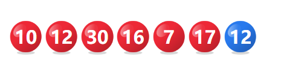
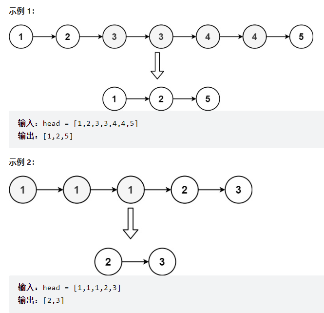

## **考试题目**

### 第一题

**需求**

某双色球系统，红球是1-35之间的数据，篮球是1-15之间的数据，一注双色球号码是由6个不重复的号码和1个篮球号码组成的。



**具体功能点的要求如下：** 

* 请随机一组双色球号码，6个红球号码要求不重复，且升序排序输出，篮球号码放在最后面输出。

* 假设上图展示的是中奖号码，请用程序判断出第一个功能随机出的双色球号码中了几个红球和几个篮球。

  

### 第二题

- 某班级要组织秋游活动，有四个景点的数据可以选择，依次是：“东湖”、"黄鹤楼"、“木兰文化区”、“归元禅寺”，每名学生最多可以选择两个想去的景点，最少要选择1个想去的景点，现在系统收集到了班级多名学生选择的信息如下。

```java
String info = "10001,张无忌,男,2023-07-22 11:11:12,东湖-黄鹤楼#10002,赵敏,女,2023-07-22 09:11:21,黄鹤楼-归元禅寺#10003,周芷若,女,2023-07-22 04:11:21,木兰文化区-东湖#10004，小昭,女,2023-07-22 08:11:21,东湖#10005，灭绝,女,2023-07-22 17:11:21,归元禅寺"";
```

- 新建测试类，在类中书写 main 方法，在方法中完成如下业务逻辑：

  - **业务一：**

    - 需要你解析上面的字符串，获取里面的用户数据，并封装到Sutdent对象中

    - 多个Student对象在添加到List<Student> 集合中

    - 注意：
    
      - 字符串中的规则如下，多个用户用 # 拼接，用户的信息之间用 , 拼接,多个景点是用-拼接的。
    - 其中用户的id和选择时间是需要进行类型转换的，其中id需要将String转成Long，选择时间需要将String转成LocalDateTime。
    
  - **业务二：**

    - 遍历上面获取的List<Student> 集合，统计里面每个景点选择的次数，并输出 景点名称和选择的次数。

    **业务三：**

    * 请用程序计算出哪个景点想去的人数最多，以及哪些人没有选择这个最多人想去的景点。


### 第三题

**需求**

* 现在有n个物品，每个物品都是液体，液体存在重量和价值，现在要求你只能从如下提供的液体中总共取走10升液体，每种液体每次可以不拿，全拿，或拿一部分，问取走的10升液体的最高价值是多少。请用程序来完成。

```
 名称           重量(升)	   总价值   
  水		       4      	   24      
  牛奶  		  8      	  160     
  五粮液		 2    	     4000    
  可乐		  6     	  108    	
  茅台		  1    	      4000    
```


**具体功能点的要求如下**

1、请按照如上数据的顺序，将每种液体数据依次添加到程序中来（注意：可以创建对象封装每种液体数据，并添加到ArrayList集合中去）

2、请用程序计算出取的10升液体的最高价值是多少？以及10升液体具体是哪些液体组成，各自取了多少。


### 第四题

**需求**：

某企业员工小泰，作息规律为上三天班，休息一天，且该员工周六日一定是要双休的，然后顺延上三天班休息一天。该员工第一次休息日是2022-03-02日。

**具体功能点的要求如下**

1、请你开发一个程序，当小泰输入年以及月后，立即显示出该月份的休息日详情。

​		**示范**（注意：示范信息重点在于参考格式，结果不一定是准确的，请自行确保计算结果正确性）：

​		**请小泰输入查询的月份（月份必须是2022年3月之后的月份）： 2023-5 **

​		**2023-5-1[周一-休息]   2023-5-2[周二-上班]   2023-5-3[周三-上班]  2023-5-4[周四-上班]  2023-5-5[周五-休息]**

​		**2023-5-6[周六-休息] 2023-5-7[周日-休息] 2023-5-8[周一-上班] ... **

2、请找出小泰从此刻当月(例如：2023年7月) 到 未来五个月（总共6个月），哪个月份的休息日是最多的，总共是休息多少天，详情是怎么样的。

3、小泰自己设置了一个闹钟，闹钟的开始时间为：2023年07日24日 07:30:00 ，**请利用给的素材代码（在Timer文件夹下）**，补全代码，产生一个如下的倒计时效果，倒计时要展示剩余：多少天多少时多少分和多少秒。且闹钟时间到了后输出：小泰起床！并直接关闭程序（可以通过this.cancel();这行代码关闭定时器执行，也就是关闭程序）！


### 第五题

**需求：**

* ArrayList集合是很重要的一种集合，请手工书写一个MyArrayList集合模拟ArrayList集合的部分功能。

**具体功能点的要求如下：**

1、MyArrayList需要支持泛型，内部使用数组作为容器。

2、为MyArrayList提供一个public boolean add方法。（需要按照MyArrayList集合的扩容要求进行实现）

3、在MyArrayList中开发一个在指定索引位置处插入数据的方法，例如：public void add(int index, E element)  方法。

4、在MyArrayList中开发一个批量添加数据的方法：public boolean addAll(Collection<? extends E> c)：这个方法可以为ArrayList集合批量添加另一个集合的数据。（需要按照MyArrayList集合的扩容要求进行实现）

5、在MyArrayList中开发一个获取集合大小的size ()方法。

6、能够在MyArrayList集合中开发一个forEach方法，这个方法支持使用Lambda进行遍历，至于函数式接口叫什么名称无所谓。

7、编写测试用例对自己编写的MyArrayList集合进行功能正确性测试。


### 第六题

**需求**

在Java开发中，链表是一种常见的数据结构，请自己设计一个单链表叫MyLinkedLis（要求支持泛型），单链表中的节点应该具备两个属性：`val` 和 `next` 。`val` 是当前节点的值，`next` 是指向下一个节点的指针/引用。并完成如下要求的功能点。

**具体功能点的要求如下**

注意：要求每个功能设计完成后，都要在Test类的main方法中，提供测试代码。

1、在MyLinkedList类中设计一个add方法，可以用于为链表添加数据。

2、在MyLinkedList类设计一个foreach方法，可以用于遍历链表的全部数据。

3、在MyLinkedList类设计一个`deleteAtIndex(int index)` 方法：如果下标有效，则删除链表中下标为 `index` 的节点。

4、在MyLinkedList类设计一个sort方法，可以对链表进行升序排序。

5、添加一个已排序的链表，然后，要求在MyLinkedList类中开发一个方法deleteDuplicate， 这个方法可以删除原始链表中所有重复数字的节点，只留下不同的结点，并要求遍历出当前处理后的链表。

例如：



